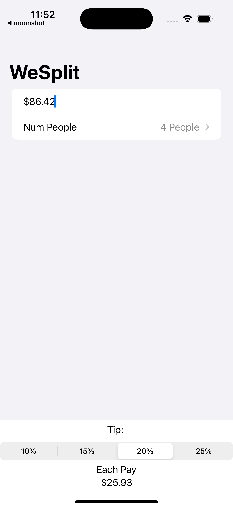

# WeSplit

A tiny SwiftUI app that splits a restaurant check with tip across a group. This was my first SwiftUI project, focused on learning state, bindings, format styles, and basic navigation.



## Features
- Enter a bill amount with currency formatting
- Choose number of people to split the check
- Pick a tip percentage with a segmented control
- See the amount each person pays in real time
- Dismiss the keyboard with a toolbar Done button

## How it works
Key pieces of state:

```swift
@State private var checkAmount: Double  = 0.0
@State private var numPeople: Int = 2
@State private var tipPercentage: Double = 0.20
```

Per person total is derived from those values:

```swift
var totalPerPerson: Double {
    let totalBill = checkAmount + (checkAmount * tipPercentage)
    return totalBill / Double(numPeople)
}
```

Currency and percent are shown using Swift’s format styles:

```swift
TextField("Amount", value: $checkAmount, format: .currency(code: Locale.current.currency?.identifier ?? "USD"))
Picker("Tip Percentage", selection: $tipPercentage) {
    ForEach([0.10, 0.15, 0.20, 0.25], id: \.self) {
        Text($0, format: .percent)
    }
}.pickerStyle(.segmented)
```

## Requirements
- Xcode 16 or newer
- iOS 17 or newer
- SwiftUI

## Getting started
1. Open the project in Xcode.
2. Run on a device or simulator.
3. Type an amount, pick the number of people and a tip.
4. The per person total updates as you go.

## Customization ideas
- Add more tip options or let users enter any percent
- Show the total bill including tip
- Remember the last used settings with AppStorage
- Add currency selection
- Dark and light appearance tweaks

## License
MIT
